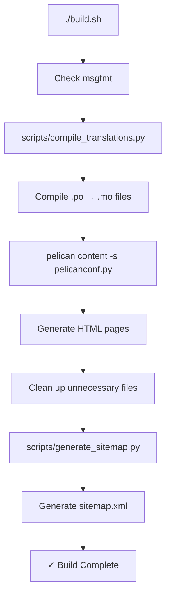

# Project Structure

Clean, organized structure for the Praxis Saewska website.

## 📁 Directory Overview

```
praxis-saewska.github.io/
│
├── 📄 Core Configuration Files
│   ├── pelicanconf.py              # Pelican development config
│   ├── publishconf.py              # Pelican production config
│   ├── site_data.py                # Practice data (hours, contact, info)
│   ├── pyproject.toml              # Python dependencies (uv)
│   ├── build.sh                    # Main build script
│   └── README.md                   # Main documentation
│
├── 📝 content/                     # Website content
│   ├── pages/                      # Static pages (.md files)
│   │   ├── index.{lang}.md        # Homepage (4 languages)
│   │   ├── about.{lang}.md        # About page
│   │   ├── faq.{lang}.md          # FAQ page
│   │   ├── contact.{lang}.md      # Contact page
│   │   ├── privacy.{lang}.md      # Privacy policy
│   │   └── impressum.{lang}.md    # Legal notice
│   │
│   ├── articles/                   # Blog posts
│   │   └── *.{lang}.md            # Article files
│   │
│   ├── images/                     # Media files
│   │   └── *.png, *.jpg, *.svg
│   │
│   └── 🔧 Static Files
│       ├── robots.txt              # Search engine directives
│       ├── llms.txt                # AI crawler guidelines
│       ├── _worker.js              # Cloudflare Worker (language redirect)
│       ├── _redirects              # Cloudflare redirects
│       ├── site.webmanifest        # PWA manifest
│       └── CNAME                   # Custom domain config
│
├── 🎨 themes/
│   └── med_praxis/                 # Custom theme
│       ├── templates/              # Jinja2 templates
│       │   ├── base.html          # Base template (meta tags, hreflang)
│       │   ├── index.html         # Homepage (Physician + MedicalBusiness schema)
│       │   ├── faq.html           # FAQ page (FAQPage schema)
│       │   ├── article.html       # Article (BlogPosting + BreadcrumbList)
│       │   ├── about.html         # About template
│       │   └── ...
│       │
│       ├── static/                 # Static assets
│       │   ├── css/               # Stylesheets
│       │   ├── js/                # JavaScript
│       │   └── images/            # Theme images
│       │
│       └── translations/           # UI translations
│           ├── de/LC_MESSAGES/messages.po
│           ├── en/LC_MESSAGES/messages.po
│           ├── ru/LC_MESSAGES/messages.po
│           └── uk/LC_MESSAGES/messages.po
│
├── 🔨 scripts/                     # Build utilities
│   ├── README.md                   # Scripts documentation
│   ├── compile_translations.py     # Compile .po → .mo files
│   └── generate_sitemap.py         # Generate sitemap.xml (custom)
│
├── 📚 docs/                        # Project documentation
│   └── seo/                        # SEO documentation
│       ├── README.md               # SEO docs overview
│       ├── SEO_FINAL_SUMMARY.md   # Complete SEO overview
│       ├── SEO_OPTIMIZATION_SUMMARY.md  # Technical details
│       ├── SEO_IMPLEMENTATION_VERIFIED.md  # Testing results
│       ├── SEO_QUICK_REFERENCE.md # Quick troubleshooting
│       ├── DEPLOY_CHECKLIST.md    # Deployment guide
│       ├── SITEMAP_DECISION.md    # Sitemap implementation rationale
│       └── CLOUDFLARE_WORKER_SEO.md  # Worker SEO compatibility
│
└── 📦 output/                      # Generated site (git-ignored)
    ├── de/                         # German site
    ├── en/                         # English site
    ├── ru/                         # Russian site
    ├── uk/                         # Ukrainian site
    ├── sitemap.xml                 # Auto-generated sitemap
    ├── robots.txt                  # Copied from content/
    ├── llms.txt                    # Copied from content/
    └── theme/                      # Static assets
```

## 📖 Key Files by Purpose

### 🏗️ Build & Configuration

| File | Purpose |
|------|---------|
| `build.sh` | Main build script (translations + Pelican + sitemap) |
| `pelicanconf.py` | Development configuration |
| `publishconf.py` | Production configuration |
| `site_data.py` | Central data: hours, contact, practice info |
| `pyproject.toml` | Python dependencies (managed by uv) |

### 📝 Content Editing

| File | Purpose |
|------|---------|
| `content/pages/*.{lang}.md` | Edit page content (homepage, about, FAQ, etc.) |
| `content/articles/*.{lang}.md` | Add/edit blog posts |
| `site_data.py` | Edit hours, contact info, practice details |
| `themes/med_praxis/translations/*/messages.po` | Edit UI translations |

### 🔧 Maintenance Scripts

| File | Purpose |
|------|---------|
| `scripts/compile_translations.py` | Compile .po to .mo (auto-run by build.sh) |
| `scripts/generate_sitemap.py` | Generate sitemap.xml (auto-run by build.sh) |

### 📚 Documentation

| File | Purpose |
|------|---------|
| `README.md` | Main project documentation |
| `CLAUDE.md` | Claude Code instructions |
| `docs/seo/README.md` | SEO documentation index |
| `docs/seo/DEPLOY_CHECKLIST.md` | Deployment guide |
| `docs/seo/SEO_QUICK_REFERENCE.md` | Quick troubleshooting |
| `scripts/README.md` | Scripts documentation |

### 🌐 SEO & AI

| File | Purpose |
|------|---------|
| `content/robots.txt` | Search engine crawler directives (12+ AI bots) |
| `content/llms.txt` | AI model usage guidelines |
| `output/sitemap.xml` | Auto-generated sitemap (48 URLs) |
| `content/_worker.js` | Cloudflare Worker (language detection) |

## 🔄 Build Process



## 📊 File Count Summary

| Category | Count |
|----------|-------|
| **Configuration** | 5 files |
| **Content Pages** | 24 files (6 pages × 4 languages) |
| **Build Scripts** | 2 files |
| **Documentation** | 10+ files |
| **Templates** | 13+ files |
| **Translation Files** | 4 files (.po) |
| **Static Assets** | Multiple (CSS, JS, images) |

## 🎯 Clean Structure Benefits

### ✅ Organized
- Scripts in `scripts/` (not root)
- Documentation in `docs/` (not root)
- Clear separation of concerns

### ✅ Maintainable
- Easy to find files
- Clear purpose for each directory
- Well-documented

### ✅ Scalable
- Add new scripts → `scripts/`
- Add new docs → `docs/`
- Add new content → `content/`

### ✅ Professional
- No clutter in root directory
- Industry-standard structure
- Easy for new contributors

## 🔍 Finding Files

### "Where do I edit...?"

**Practice hours/contact info:**
→ `site_data.py`

**Page content (text):**
→ `content/pages/{page}.{lang}.md`

**Blog articles:**
→ `content/articles/`

**UI translations (buttons, labels):**
→ `themes/med_praxis/translations/{lang}/LC_MESSAGES/messages.po`

**SEO documentation:**
→ `docs/seo/`

**Build scripts:**
→ `scripts/`

### "What does this file do...?"

**build.sh:**
Main build script - run this to build everything

**pelicanconf.py:**
Pelican configuration for development

**publishconf.py:**
Pelican configuration for production

**site_data.py:**
Central data file for hours, contact, practice info

**scripts/compile_translations.py:**
Compiles translation files (.po → .mo)

**scripts/generate_sitemap.py:**
Generates sitemap.xml for SEO

## 🚀 Common Tasks

### Build the site
```bash
./build.sh
```

### Edit practice hours
```bash
vim site_data.py  # Edit OPENING_HOURS dict
./build.sh
```

### Add new page
```bash
# Create files for all 4 languages
vim content/pages/new-page.de.md
vim content/pages/new-page.en.md
vim content/pages/new-page.ru.md
vim content/pages/new-page.uk.md
./build.sh
```

### Update UI translations
```bash
vim themes/med_praxis/translations/de/LC_MESSAGES/messages.po
./build.sh  # Automatically compiles translations
```

### Check SEO documentation
```bash
open docs/seo/README.md
```

---

**Last Updated:** 2026-01-27
**Structure Version:** 2.0 (Cleaned and Organized)
